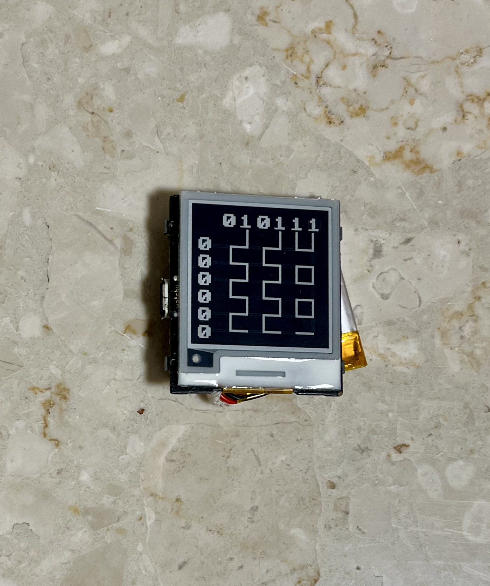
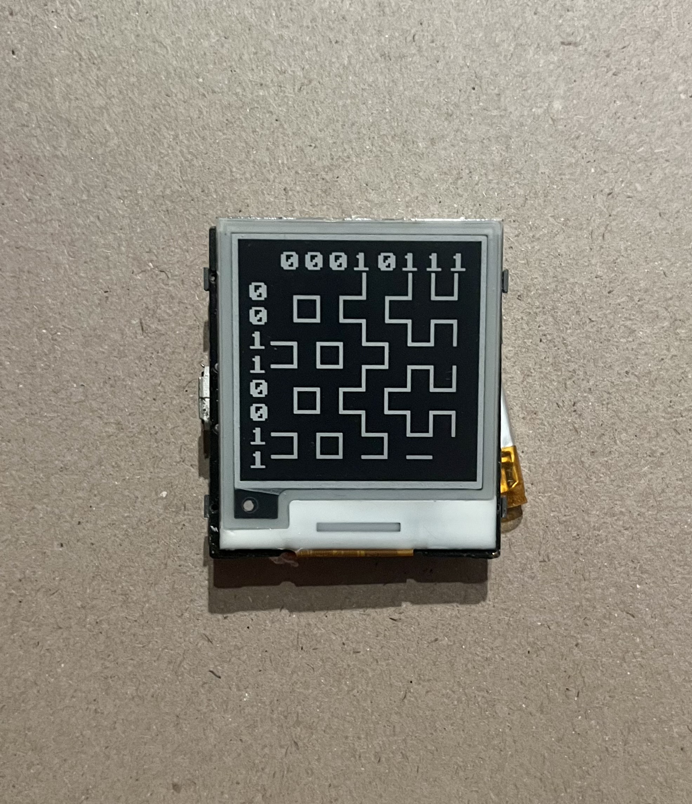

# Binary Stitching Watch Face
*Written in: December 2022*

## Table of contents
* [About the project](#about-the-project)
* [Technologies](#technologies)
* [Setup](#setup)

## About The Project
This project is a watch face for Watchy - an Open Source E-Paper Watch. I came up with a concept of translating the time into binary numbers which are used to generate a Hitomezashi Stitch Patterns. This visual way of showing the time gives us total of 1440 (24*60) different patterns, each for every hour and minute of the day. Top row represents the hour, and the column on the left shows current minute. The pattern is generated by drawing dashed lines for every digit. Those lines are offset based on weather the digit is 1 or 0. 
There are two versions of this face:

### Basic Face
This version translates decimal numbers representing current hour and minute into binary numbers.

### Version Two
This version individually translates every decimal digit representing current hour and minute into binary numbers. So first 4 bits are tens, and next 4 bits are units. It's easier to read than the Basic version. 

	
## Technologies
Project is created with:
* sqfmi/Watchy version: 1.4.3
* C
* C++
	
## Setup